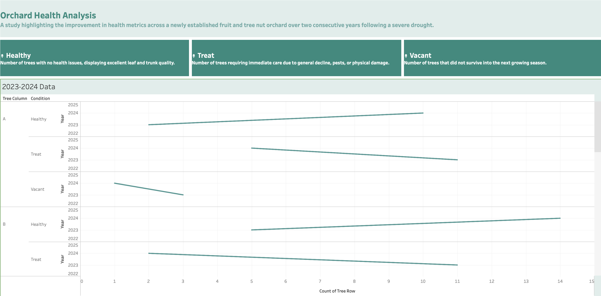

# Orchard-Health-Analysis
A study highlighting the improvement in health metrics across a newly established fruit and tree nut orchard over two consecutive years following a severe drought.

# Orchard Health Analysis Dashboards

## Orchard Health Analysis Dashboards

This ag-tech dashboard was created using a custom CSV I developed while working as an Operations Manager in the Agricultural Industry, where I began integrating complex data insights into fieldwork.

Agricultural assets, such as orchards, generate highly variable and location-specific data. I led the on-site tracking process and designed the dataset structure to reflect meaningful patterns in orchard health across seasons. The set up allows for further data insights to be added to this template. 

This project reflects my growing focus on upgrading AgTech data functions, using tools like Tableau and more to bridge field operations with digital insights. 

## Dashboard Key

Healthy: Trees showing strong leaf and trunk quality with no visible health issues

Treat: Trees requiring immediate care due to declining health, pest presence, or physical damage

Vacant: Trees that did not survive into the following season, resulting in an empty planting site

This project illustrates how agricultural operations can adopt digital tools and visual tracking methods to monitor orchard health, guide timely interventions, and build toward long-term sustainability. It also serves as an early prototype for more advanced ag-tech systems and data logging in the future.

This dashboard is part of a broader ag-tech series focused on practical, field-based digital solutions in agriculture.

## Tools Used

Tableau Public – used to visualize complex agricultural assets such as fruit and nut trees, whose health and productivity vary with seasonal and environmental factors.

## Live Dashboards
- [View Tableau Dashboard](https://public.tableau.com/views/OrchardHealthAnalysis/Dashboard?:language=en-US&:sid=&:redirect=auth&:display_count=n&:origin=viz_share_link)

## Data Cleaning
* Vacant spaces were originally recorded as NULL values in the CSV dataset and were later reclassified as "Vacant"to reflect tree loss accurately.
* Health conditions were standardized into three clear categories: Healthy, Treat, and Vacant to allow consistent analysis across seasons.
* Tree rows were grouped and labeled (e.g., Row A, Row B) to enable a clear visual and temporal comparison between 2023 and 2024.

## Challenges  
Data Collection- Tree health field data was initially recorded by hand while the tracking system was being developed. This meant that the data needed to be streamlined for impactful visuals and data tracking. 

Modernization- Granular soil data required the use of legacy soil maps, which had to be digitized, geo-referenced, and cleaned. Modernizing this data for visual integration was time-consuming and posed challenges for alignment with current mapping tools.

## Analysis

A year-over-year comparison revealed a clear increase in healthy trees in both Row A and Row B after the solar irrigation system was installed in early 2024.
Trees marked “Vacant” declined notably from 2023 to 2024, indicating improved survival rates.
“Treat” cases declined slightly but still existed, underscoring the need for ongoing monitoring and possibly targeted intervention (e.g., pest treatment, pruning, or soil amendment).
The improvements are most pronounced in Row A, possibly due to topography or irrigation proximity.

## Conclusion

The dashboard demonstrates how small to medium agricultural operations can benefit from visualizing tree health over time. By documenting a shift from drought-stressed conditions in 2023 to improved outcomes in 2024, this case supports investment in sustainable infrastructure like solar-powered irrigation. As the orchard matures, future enhancements could include soil sensors, weather integrations, and real-time alerting systems to further automate crop health insights.

## License
MIT License – free to use with attribution.
